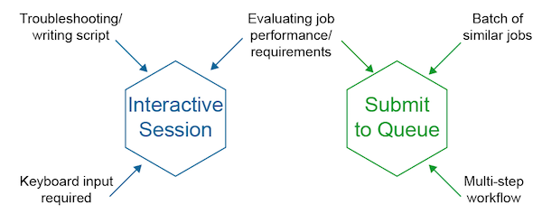
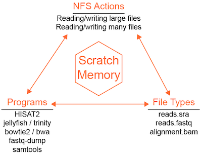
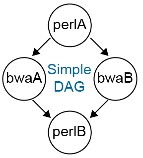

# Computing with HTCondor

## Quick start

The primary way to do computing on the Data Science infrastructure is through the HTCondor cluster.
Log into `stargate.datasci.danforthcenter.org` to use the cluster. You can quickly get access to 
computing resources by checking out an [interactive session](htcondor.md#interactive-session) from the cluster:

```bash
condor_submit -i
```

Otherwise, jobs are submitted by creating a job configuration file and submitting it to the scheduler:

```bash
condor_submit jobfile
```

## Basic infrastructure concepts

* **Central manager server**. This server is the central brain of HTCondor. It is the interface between job scheduling 
machines and job execution machines. Users do not interact with this server (`basestar` in our case) directly.
* **Scheduler server**. This server manages a job queue and exchanges job information with the central manager. 
Multiple servers can run the job scheduling service. Currently the Data Science infrastructure runs the scheduler 
on `stargate`.
* **Execution server**. These are the servers where jobs are run. Jobs submitted from a scheduler (`stargate`) are 
analyzed by the central manager (`basestar`) to determine which execution servers can support the job 
(based on resource requests), whether or not resources are free currently, and what the job priority 
(rank in the queue) is.


* **Job priority**. HTCondor uses a fair share model to assign jobs a priority. This means jobs are executed in an 
order that preserves resource allocation shares as much as possible (as opposed to a first-come, first-serve model).
* **Slots**. HTCondor matches jobs to resource "slots." For the Data Science cluster, each server is configured as a 
single resource slot (all the CPUs and RAM in one slot). Each slot is configured to be partitionable, so a job 
requesting less than 100% of all the resources in a slot will cause the slot to be divided so that the remaining 
resources can be matched to another job.
* **Universe**. HTCondor provides different "universes" for executing jobs. Each universe has different properties. 
For now we will primarily use the vanilla universe.
  * Vanilla: Essentially the same as running any basic program with one or more processors.
  * Docker: Run jobs in isolated environments (containers).

## Accessing HTCondor

!!! note
    Currently all HTCondor transactions can be done from `stargate.datasci.danforthcenter.org`.

For work that needs to be done outside of the queue
(e.g. software development/debugging, small file operations, etc.),
an [interactive session can be requested](htcondor.md#interactive-session). Jobs that require 
more than a few seconds or more than 1 CPU cannot be run on `stargate`.



## Interactive sessions

In general, most jobs should be submitted using job files, but in cases
where an interactive session is needed (for testing for example), shell
sessions can be requested from the HTCondor queue. Interactive sessions
are similar to logging into a server with ssh except the cluster will
choose the server for you and it will automatically log out after 2 hours 
of inactivity and once disconnected will terminate any running jobs, 
including `screen` and `tmux` sessions.

A simple interactive session with 1 CPU and 1 GB of RAM can be requested simply with:

```bash
condor_submit -i
```

If you need additional resources you can add job configuration key-value pairs
```bash
condor_submit -i request_cpus=10 request_memory=10G
```

* CPU and memory (RAM) can be requested.
* Condor creates a mini-machine on one of the executable servers for your use.
* Fees accrued regardless of usage once the session has started (since these resources 
are checked out and are unavailable to the queue).

## Submitting a program to the cluster

Instead of typing your command into the command line, you need to write
a job description file to submit the program to HTCondor. The basic job
description file is fairly simple.

### Anatomy of a simple HTCondor job file


See [Summary of job configuration options](htcondor.md#summary-of-job-configuration-options) for more details.

#### To submit this job to the queue

```bash
condor_submit jobfile
```

## Requesting multiple CPUs or other resources

If you need to submit a job that uses multiple CPUs or other significant
resources, add these requests to the job description file. In the
example below, the job file requests 8 CPUs in addition to the default
memory and disk request sizes.

```
####################
#
# Example Vanilla Universe Job
# Multi-CPU HTCondor submit description file
#
####################

universe         = vanilla
getenv           = true
request_cpus     = 8

log              = bowtie2.alignment.log
output           = bowtie2.alignment.out
error            = bowtie2.alignment.error

executable       = /bioinfo/bin/bowtie2
arguments        = -f --no-unal --threads 8 -x ref.fasta -U reads.fasta -S aln.sam

queue
```

!!! note
    Setting `request_cpus = 8` only tells HTCondor how many CPU resources to 
    allocate to the job, it does not set or constrain the program's resources
    in anyway. Therefore, it is important to configure the program to use
    resources in the same way (for example the `--threads` option in bowtie2).

## Disk-intensive jobs using scratch

Some programs are limited by disk IO (reads/writes). The Data Science infrastructure
uses a shared filesystem (NFS) that makes it convenient to access files across the
infrastructure but reduces available disk IO as a consequence. IO-constrained jobs
will run slower on NSF and can also cause NFS performance to decline for other
programs trying to access data. For IO-constrained programs, a server-specific
high-speed scratch volume can be used to improve job performance. HTCondor has
a built-in mechanism for staging job files in scratch.



To active the transfer of input files, output files, or both, 
additional job file configuration is needed.

### Example using HISAT2

Copies the input file to scratch, creates all outputs in scratch, and automatically copies all outputs
back to the submission directory.

```
####################
#
# Example Vanilla Universe Job :: Using SCRATCH space
# ** Executable is NOT copied over **
# Multi-CPU HTCondor submit description file
#
####################

universe         = vanilla
getenv           = true
executable       = /bioinfo/bin/hisat2
arguments        = -q -x genome.fa -U singleEnd.fastq -S output.sam --rna-strandness R -p 20
log              = hisat2.groupID.log
output           = hisat2.groupID.out
error            = hisat2.groupID.error
request_cpus     = 20
request_memory   = 10G
transfer_executable = False
should_transfer_files = YES
transfer_input_files = singleEnd.fastq
# HTCondor will copy any input files listed here (comma-separated)
# HTCondor will transfer all output files since none are listed specifically

###################

queue
```

### Example using Trinity

Copies the input FASTQ data to scratch, creates the Trinity output directory in scratch,
and copies only the Trinity.fasta result file back to the submission directory. All other
output files are discarded.

```
universe                 = vanilla
getenv                   = true

condor_output            = /path/to/condor/output/dir/

request_cpus             = $(cpu_req)
request_memory           = $(memory_req)
request_disk             = $(disk_req)

notification             = Complete

ID                       = $(Cluster).$(Process)
output                   = $(condor_output)$(run_type).$(ID).out
error                    = $(condor_output)$(run_type).$(ID).err
log                      = $(condor_output)$(run_type).$(ID).log
###################

executable               = /bioinfo/installs/trinity/Trinity
arguments                = --seqType fq --CPU $(cpu_req) --max_memory $(memory_req) --output $(output_name)/ --SS_lib_type RF --left left.fastq.gz --right right.fastq.gz


transfer_executable      = False
should_transfer_files    = YES
transfer_input_files     = /full/path/to/left.fastq.gz,/full/path/to/right.fastq.gz

when_to_transfer_output  = ON_EXIT
transfer_output_files    = $(output_name)/Trinity.fasta

## Need to edit info here ##
run_type                 = Trinity
output_name              = trinity_$(sampleID)
sampleID                 = [sample ID]

cpu_req                  = [Number of processors]
memory_req               = [RAM request i.e. 20G]
disk_req                 = [scratch disk size request 3G]
############################

queue
```

### Managing file transfers within your job

If you want your program/script to manage file transfers between NFS and scratch,
or you want to use scratch in an interactive session, you can access your job-specific
scratch directory using the environment variable `$_CONDOR_SCRATCH_DIR`, for example:

```bash
cd $_CONDOR_SCRATCH_DIR
```

## Running multiple instances of the same program in parallel

It is common to need to run the same program on different input files. Because the
program is processing independent input data, these processes can be run in 
parallel in the cluster and can be submitted using a single HTCondor job file.

The example below will run four cufflinks jobs, substituting the value
of `group` in every time `queue` is called.

!!! warning
    When running a batch of jobs from a single job file, if `notification = complete` is set within
    the job file, then you will receive an email after each individual job is completed. Not a problem
    if a handful of jobs are being run, but if you are launching 100s-1000+ jobs, then neither your email 
    nor the system is going to like that many emails. One approach is create a DAGman wrapper and submit 
    the condor job file via `condor_submit_dag` with the command line argument `-notification complete` included. 
    Then HTCondor will only email you once the entire suite of jobs have been completed. See 
    [DAG workflows](htcondor.md#dag-workflows).

### Example using cufflinks

```
####################
#
# Example Vanilla Universe Job :: 
# This launches multiple jobs, using the 'group' variable info to find 
# and create the required files [this example would queue up 4 jobs]
# Multi-CPU HTCondor submit description file
#
####################

universe         = vanilla
getenv           = true
executable       = /bioinfo/bin/cufflinks
arguments        = -o output/$(group) --GTF-guide file.gtf -p 15 --library-type fr-firststrand -u -L $(group) $(group)_RNAseq.bam
log              = $(group).cufflinks.log
output           = $(group).cufflinks.out
error            = $(group).cufflinks.error
request_cpus     = 15
request_memory   = 10G

###################

group = controls_1
queue 1

group = controls_2
queue 1

group = controls_3
queue 1

group = controls_4
queue 1
```

### Example using fastq-dump

Rather than writing out each job queue statement as above, you can read data from an input file and use the data as
parameters for your condor job. In this example we create a file containing NCBI SRA Record IDs:

sra-ids.txt

```
SRR390726
SRR390727
SRR390728
SRR390729
```

This fastq-dump job file is configured to download and convert SRA files to FASTQ in scratch
and copy the FASTQ files back to the submission directory. Four jobs will be created by this
example.

```
###############################################################################################
## Housekeeping
###############################################################################################

universe                 = vanilla
getenv                   = true

request_cpus             = 1
request_memory           = 1G
request_disk             = 10G

ID                       = $(Cluster).$(Process)
output                   = fastqdump.$(ID).out
error                    = fastqdump.$(ID).err
log                      = fastqdump.$(ID).log

###############################################################################################
## Executable & arguments
###############################################################################################

executable               = /bioinfo/bin/fastq-dump
arguments                = -I --split-files --gzip $(SRA_record)

transfer_executable      = False
should_transfer_files    = YES
when_to_transfer_output  = ON_EXIT

# Get SRA Record IDs from the intput file
queue SRA_record from sra-ids.txt
```

The input file can also have multiple variables in a tab-delimited format:

file-of-vars.txt

```
sample1_var1    sample1_var2
sample2_var1    sample2_var2
```

```
# Example snippet
queue var1, var2 from file-of-vars.txt
```

## DAG workflows

Often data processing and analysis requires running more than one program, where the output
of one process is passed as the input of the next. This type of arrangement of processes
and dependencies can be described as a directed acyclic graph (DAG) and HTCondor can
build workflows using the built-in [DAGMan scheduler](https://htcondor.readthedocs.io/en/stable/users-manual/dagman-applications.html).

A simple way to build a workflow (or a pipeline) is to write a shell script where one
program runs, then the next, and so on. While easy to set up, the advantages of DAG
workflows are:

* Coordinates multiple jobs in serial **and** in parallel.
* Specifically request resources (CPUs, scratch disk space, RAM) on a **per-job-basis**.
  * More cost-effective than just checking out i.e. 40 CPUs because one step of a pipeline uses 40 while the remainder use 1.
* Error and log reporting for each job --> easier for troubleshooting.
* Using a DAGman config file + 1 condor job file template avoids clutter.
* Workflows can be restarted or rescued from any job node without rerunning prior steps.

### Basic format of DAG file

The DAG input file has a basic set of commands: 

* JOB: specifies an HTCondor job
  * Syntax: `JOB JobName SubmitDescriptionFileName [DIR directory] [NOOP] [DONE]`
* PARENT CHILD: specifies the dependencies within the DAG
  * Syntax: `PARENT ParentJobName... CHILD ChildJobName...`

**Example DAG Input File**

```
JOB    perlA    jobfile_perlA.condor
JOB    bwaA     jobfile_bwaA.condor
JOB    bwaB     jobfile_bwaB.condor
JOB    perlB    jobfile_perlB.condor

PARENT perlA      CHILD bwaA bwaB
PARENT bwaA bwaB  CHILD perlB
```

In the above example, each job has a corresponding HTCondor job file. The format
of these files is the same as those described in the above sections. In fact,
the individual jobs can be submitted as ordinary HTCondor jobs. In this example,
the job "perlA" is run first and must finish successfully before jobs "bwaA" and
"bwaB" will start, in parallel. Both "bwaA" and "bwaB" must finish before "perlB"
runs.



### Submitting a DAG workflow

A DAG is submitted to the queue using `condor_submit_dag DAG_InputFilename`

!!! note
    Notifications are set by default to NONE; to be notified when the entire DAG
    workflow has completed, add the flag `-notification complete` to the 
    `condor_submit_dag` command.

### DAG rescue/restart

If a node in a workflow fails, the remaining steps are not run and the workflow
terminates. A rescue file is created that records which nodes were completed
successfully and which node triggered a workflow failure. The failed node job
file can be updated to fix the issue and the workflow can be restarted from the
failed node without rerunning previously successful steps by rerunning 
`condor_submit_dag DAG_InputFilename`.

### DAG wrapper for batch HTCondor job file

When submitting an HTCondor job file to the queue that contains 100s+ jobs, if you wish to have 
an email notification once all jobs are complete, a simple approach is adding a DAG wrapper around
the job file - with no changes needed to the job file itself.

##### Example DAG Wrapper File Contents:

```
JOB  perl1 condor.jobs.perl.sh
```

##### Example condor.jobs.perl.sh Contents:

```
universe                 = vanilla
getenv                   = true

condor_output            = outputs_condor

request_cpus             = 1
run_type                 = perl

ID                       = $(Cluster).$(Process)
output                   = $(condor_output)/$(run_type).$(ID).out
error                    = $(condor_output)/$(run_type).$(ID).err
log                      = $(condor_output)/$(run_type).$(ID).log

executable               = script.pl
arguments                = -i $(filename).fastq -o $(filename).fasta

filename                 = WT_1
queue

filename                 = WT_2
queue

filename                 = WT_3
queue
```

DAG will launch the three jobs. By running `condor_submit_dag -notification complete dag.sh`
DAG will launch the 3 jobs within the job file and send an email once all three have completed.

## Job monitoring and control

It is important to check on the status of the cluster and jobs both before and
after submitting to the scheduler. Checking the status of the cluster prior to
submitting jobs can help you pick the right amount of resources and monitoring
jobs after submitting helps keep you aware of whether your job(s) are behaving
correctly and whether you have jobs you may have forgotten about that are still
running.

!!! note
    While Data Science staff do monitor the cluster and help identify issues, 
    it is ultimately your responsibility to make sure your jobs are running
    as intended.

### Status of the HTCondor queue

```bash
condor_q
```

`condor_q` shows a table of your submitted jobs and a summary of all other
jobs submitted.

```
OWNER     BATCH_NAME    SUBMITTED   DONE   RUN    IDLE  TOTAL JOB_IDS
user1 ID: 116979   9/16 17:07      _      1      _      1 116979.0

Total for query: 1 jobs; 0 completed, 0 removed, 0 idle, 1 running, 0 held, 0 suspended
Total for user1: 1 jobs; 0 completed, 0 removed, 0 idle, 1 running, 0 held, 0 suspended
Total for all users: 77 jobs; 0 completed, 0 removed, 3 idle, 72 running, 2 held, 0 suspended
```

To view all jobs in the queue run `condor_q -all`. To split up batches of jobs
run `condor_q -nobatch`. Combine the two options to get a comprehensive list of all jobs:
`condor_q -all -nobatch`.

### Status of resources in the cluster

Running `condor_status` shows the status of resources in the cluster. The default output
is not that informative for our purposes, but adding a couple options let's you see
what resources are available currently:

```bash
condor_status -avail -state
```

```
Name                                      Cpu  Mem   LoadAv   KbdIdle    State       StateTime  Activ   ActvtyTime

slot1@aerilon.datasci.danforthcenter.org   22 141029  0.000   0+02:11:51 Unclaimed  20+23:50:13 Idle   20+23:50:13
leda.datasci.danforthcenter.org             1  31896  0.000  40+06:08:54 Unclaimed  47+05:08:47 Idle   47+05:08:47
slot1@pallas.datasci.danforthcenter.org    55 176224  0.000   0+02:18:45 Unclaimed  11+06:33:37 Idle   11+06:33:21
slot1@pegasus.datasci.danforthcenter.org    8  81637  0.000   3+04:37:29 Unclaimed  20+23:03:02 Idle   20+23:03:02
slot1@scorpia.datasci.danforthcenter.org   13  82533  0.000   4+02:08:10 Unclaimed  20+21:14:50 Idle   20+21:14:50
slot1@tauron.datasci.danforthcenter.org     5 221925  0.000   3+04:39:51 Unclaimed   4+23:36:54 Idle    4+23:36:44
slot1@thanatos.datasci.danforthcenter.org  55 192351  0.000   0+02:08:48 Unclaimed  20+21:39:16 Idle   20+21:39:16

                Machines Owner Unclaimed Claimed Preempting Matched  Drain

          Idle         0     0         7       0          0       0      0

         Total         0     0         7       0          0       0      0
```

Using the Cpu and Mem columns can help guide you in selecting resources for your job.

### Status of running jobs

We developed a custom program to pull information from the HTCondor scheduler and
central manager to help users evaluate their running jobs.

```bash
condor_fullstat
```

```
  Cluster    Process  Owner           Host                                  CPUs    Memory (GB)    Disk (GB)    Run Time     Cmd
---------  ---------  --------------  ------------------------------------  ------  -------------  -----------  -----------  -------------
    54589          0  user1           aerilon.datasci.danforthcenter.org    0/4     0/10           0/1          12:07:21:38  bash
    64788          0  user2           pegasus.datasci.danforthcenter.org    1/10    45/150         0/1          01:01:03:42  bash
   116656          0  user3           aerilon.datasci.danforthcenter.org    0/10    21/100         0/1          10:08:16:40  (interactive)
   116851          0  user4           thanatos.datasci.danforthcenter.org   0/1     1/300          0/1          04:06:07:50  (interactive)
   116857          0  user4           scorpia.datasci.danforthcenter.org    0/1     4/1            0/1          04:04:47:07  (interactive)
   116870          0  user2           galactica.datasci.danforthcenter.org  2/20    2/350          0/1          04:02:40:55  mpiexec
   116950          0  user4           pallas.datasci.danforthcenter.org     0/1     1/300          0/1          02:04:03:30  (interactive)
   116961          0  user5           pegasus.datasci.danforthcenter.org    1/20    10/20          0/1          00:09:03:09  (interactive)
   116965          0  user6           scorpia.datasci.danforthcenter.org    0/5     0/0            0/1          00:06:04:14  (interactive)
   116968          0  user5           scorpia.datasci.danforthcenter.org    0/20    0/20           0/1          00:04:21:03  (interactive)
   116970          0  user4           scorpia.datasci.danforthcenter.org    0/1     1/150          0/1          00:03:52:06  (interactive)
   116977          5  user7           pegasus.datasci.danforthcenter.org    1/1     0/1            0/1          00:00:50:52  samtools
   116977         22  user7           aerilon.datasci.danforthcenter.org    1/1     0/1            0/1          00:00:50:52  samtools
---------  ---------  --------------  ------------------------------------  ------  -------------  -----------  -----------  -------------
CPU, memory, and disk resources are shown as actual usage over requested resources.
```

The Cluster and Process columns display the HTCondor job cluster and process IDs. The Owner is the username of the user
that submitted the job. Host is the remote server where the job is running. The CPUs, Memory, and Disk columns show the
current resource usage over the requested resources. The cell is colorized white when usage is within the requested
constraints, green when usage is more that 2x lower than requested, and red when usage is more than 2x higher than
requested. Run Time displays the current number of days, hours, minutes, and seconds the job has been running. The Cmd
is the program/executable running (or interactive session).

!!! note
    Unless otherwise known, you should be wary of jobs running for days. Most programs should not need to run for more
    than seconds to hours. If a job takes 1+ days to run, we recommend checking the job log files or otherwise 
    monitoring its status to make sure it is running as you expect. Please contact us if you need help.

!!! warning
    If you note that your job is using more CPU, memory, or disk resources than you requested, you may need to take
    action. We do not expect users to be able to exactly guess the correct amount of resources, but using a lot more
    than requested could put your job or other users' jobs at risk. In particular, if one or more users on a single
    host system use more RAM than the system supports the OS will kill job(s) to protect the system from crashing.

### Removing one or more jobs from the queue

To remove a job from the queue or to stop a running job, use the `condor_rm` command. The most common usage is to 
delete an entire job cluster (e.g. 100, created when you ran `condor_submit`):

```bash
condor_rm 100
```

All jobs in cluster 100 are removed. If you wanted to remove a specific process (e.g. 10) within the cluster:

```bash
condor_rm 100.10
```

Or to remove all of your jobs:

```bash
condor_rm username
```

### Analyzing jobs/Troubleshooting

If upon submitting your job the status listed on `condor_q` is "H" or "I" then your job is not running. 
There are a number of reasons why this could be and using `condor_q -analyze [jobID]` will give you more details. 
Some examples include:

#### Missing/error with executable or other input file

```
[JobID]:  Request is held.
Hold reason: Error from slot1@pallas.ddpsc.org: Failed to execute '/script.pl' with arguments Single_Astral/ Solanum,Olea: (errno=13: 'Permission denied')
```

If the executable cannot be found or executed on the remote server you will get an error like the one above. A common
mistake is to submit an executable that does not have executable permissions. In this case there are three potential
solutions:

1. Make sure the script has the correct file permissions: `chmod ugo+x script.pl`.
2. Make sure the script specifies an interpreter. The first line in this example should be `#!/usr/bin/perl`.
3. Instead of 1 or 2, set your executable to the interpreter and add the script name to arguments:

```
executable = /usr/bin/perl
arguments = script.pl
```

#### Requested resources currently unavailable

This job was listed as "I" and ended up being the next to run in the queue. The more resources you request the harder
it is to find an available slot. Very rarely, the system is completely busy and even single CPU jobs will be queued
in an idle state for a short (likely) time.

```
[jobID]:  Run analysis summary.  Of 34 machines,
     24 are rejected by your job's requirements
      0 reject your job because of their own requirements
      0 match and are already running your jobs
     10 match but are serving other users
      0 are available to run your job
	No successful match recorded.
	Last failed match: Tue Apr 19 16:28:20 2016
Reason for last match failure: PREEMPTION_REQUIREMENTS == False

The Requirements expression for your job is:
    ( TARGET.Arch == "X86_64" ) && ( TARGET.OpSys == "LINUX" ) &&
    ( TARGET.Disk >= RequestDisk ) && ( TARGET.Memory >= RequestMemory ) &&
    ( TARGET.Cpus >= RequestCpus ) && ( ( TARGET.HasFileTransfer ) ||
      ( TARGET.FileSystemDomain == MY.FileSystemDomain ) )
Suggestions:
    Condition                         Machines Matched    Suggestion
    ---------                         ----------------    ----------
1   ( TARGET.Memory >= 51200 )        15
2   ( TARGET.Cpus >= 10 )             29
3   ( TARGET.Arch == "X86_64" )       34
4   ( TARGET.OpSys == "LINUX" )       34
5   ( TARGET.Disk >= 42 )             34
6   ( ( TARGET.HasFileTransfer ) || ( TARGET.FileSystemDomain == "ddpsc.org" ) )
                                      34
```

#### Requested resources totally unavailable

This job was in "H" due to lack of resources; Condor offered a suggestion so that the job would run

```
[jobID]:  Run analysis summary.  Of 27 machines,
     27 are rejected by your job's requirements
      0 reject your job because of their own requirements
      0 match and are already running your jobs
      0 match but are serving other users
      0 are available to run your job
	No successful match recorded.
	Last failed match: Wed Apr 20 11:29:19 2016
Reason for last match failure: no match found
WARNING:  Be advised:
   No resources matched request's constraints

The Requirements expression for your job is:
    ( TARGET.Arch == "X86_64" ) && ( TARGET.OpSys == "LINUX" ) &&
    ( TARGET.Disk >= RequestDisk ) && ( TARGET.Memory >= RequestMemory ) &&
    ( TARGET.Cpus >= RequestCpus ) && ( TARGET.HasFileTransfer )
Suggestions:
    Condition                         Machines Matched    **Suggestion**
    ---------                         ----------------    ----------
1   ( TARGET.Memory >= 102400 )       0                   **MODIFY TO 54884**
2   ( TARGET.Cpus >= 20 )             5
3   ( TARGET.Arch == "X86_64" )       27
4   ( TARGET.OpSys == "LINUX" )       27
5   ( TARGET.Disk >= 400000 )         27
6   ( TARGET.HasFileTransfer )        27
```

### Inspecting job parameters

When you submit a job to the HTCondor scheduler the job parameters get translate into a job classad. To inspect the
classad of a job in the queue run `condor_q -long [jobID]`. If the job recently finished, you can do the same by looking
at history: `condor_history -long [jobID]`. You can also look up all your recent jobs: `condor_history username`.

## Optimizing resource usage and job performance

Understanding the needs and usage of system resources by a program 
will allow you to optimize your job requests. CPU usage 
is a good example: many programs have a `--threads` or `--CPU` option, but the
actual usage can vary, resulting in over-request by the user and higher
costs. Meanwhile, under-requesting scratch disk or RAM relative to the job's usage can
result in a server becoming overloaded and jobs being killed by the system.

To evaluate the requirements of a job, particularly a job that will be run repeatedly,
a good approach is to run one instance of the job and monitor the resource usage. For
scratch disk and RAM usage, the log file produced by HTCondor gives the information you need. 
At the end of the log file, once the job is complete, you will find the following:

```
	(1) Normal termination (return value 0)
		Usr 0 00:44:19, Sys 0 00:04:07  -  Run Remote Usage
		Usr 0 00:00:00, Sys 0 00:00:00  -  Run Local Usage
		Usr 0 00:44:19, Sys 0 00:04:07  -  Total Remote Usage
		Usr 0 00:00:00, Sys 0 00:00:00  -  Total Local Usage
	3943671552  -  Run Bytes Sent By Job
	639678720  -  Run Bytes Received By Job
	3943671552  -  Total Bytes Sent By Job
	639678720  -  Total Bytes Received By Job
	Partitionable Resources :    Usage  Request Allocated
	   Cpus                 :                 8         8
	   Disk (KB)            :  4475941 10485760  10716960
	   Memory (MB)          :      166      500       500
```

In this example, the job finished with a return value `0` (Normal termination), which means the program reported to
HTCondor that it finished without a fatal error. 8 CPUs were requested (and "used"). 10 GB of scratch disk were 
requested and 4.3 GB were used. 500 MB of RAM were requested and 166 MB were used.

If this job was part of a set, one might want to maximize the number of jobs 
that could simultaneously run. Thus, some possible modifications to the job file could be: 
request less scratch disk (6GB) and request less RAM (250MB). It is still a good idea to
include a buffer since not all of the jobs will have identical usage.

**CPU Usage**

The log file only reports the number of CPUs requested as this is the usage as far
as the system is concerned - these CPUs get checked out for your request and are thus
unavailable to other users. To determine CPU usage, a within-system tool is `condor_fullstat`
that will report on the actual CPU usage of a program. This could be run frequently over
the course of a job's run, with the user monitoring the actual percentage of CPUs used.

!!! note
    A logger runs every five minutes to collect job metrics. While no interface is available
    yet for users to query job performance data at the moment, Data Science staff can help get job
    metrics for you.

Example `condor_fullstat` output:

```
  Cluster    Process  Owner       Host                                CPUs    Memory (GB)    Disk (GB)    Run Time     Cmd
---------  ---------  ----------  ----------------------------------  ------  -------------  -----------  -----------  ---------
    40655          0  xxxxxxxxxx  scorpia.datasci.danforthcenter.org  1/40    2.5/90         90           19:21:28:54  job.sh
```

Job 40655 requested 40 CPUs, and has been running for >19 days. 
However, a repeated look at `condor_fullstat` determines that the job only
used 40 CPUs for an early step, and has since been only using 2.5% (or 1 CPU)
for the majority of the job. Thus, if this program were re-run, it may be worth
modifying the CPU request, or modifying the program itself.

Another approach is searching the internet - many common bioinformatic programs
have papers, blog posts, etc, that report the CPU usage efficiency. `bwa` is a good
example where requests with 8 CPUs do not have 2x improved performance over 4 CPUs.
Therefore, if you have i.e. 50 bwa jobs to run, the fastest way to get them done would
be to request 4-8 CPUs each. This means that more jobs can run simultaneously,
even if they take a bit longer each, resulting in the batch of jobs being done sooner for 
you to continue your analyses. [Intel White Paper for GATK Pipeline](http://www.intel.com/content/dam/www/public/us/en/documents/white-papers/deploying-gatk-best-practices-paper.pdf)

## Summary of job configuration options

See the [HTCondor documentation](https://htcondor.readthedocs.io/) or all options,
the most common options are described below.

* `universe` sets execution environment that your job runs in, default is vanilla.
The only other universe in use in the Data Science Facility is `docker`.
* `getenv` (true/false) sets whether or not HTCondor should import your shell
environment settings into the job before submitting to the queue. Alternatively, 
you can customize the shell environment on a per job basis by setting getenv to 
false and using the `environment` configuration option instead. 
* `request_cpus` is the number of CPUs/cores your job is allocated.
* `request_memory` is the maximum amount of RAM your job is allocated. Units can
be supplied, currently only units in Gigabytes (G) are recommended.
* `request_disk` is the maximum amount of disk space your job is allocated in scratch
disk. The Data Science infrastructure uses a shared filesystem, so requesting disk
only has effect when scratch drives are used (e.g. when file transfers are activated).
* `log` is the filename (and path if provided) of the HTCondor job log file.
* `output` is the filename (and path if provided) of the standard output (stdout)
stream of the program (executable).
* `error` is the filename (and path if provided) of the standard error (stderr)
stream of the program (executable).
* `executable` is the full path to the program you want to run. 
* `arguments` are all the remaining options you would normally put on the command 
line after the executable. 
* HTCondor will not notify you about the status of a job by default. If you want to
get an email when your job change state, set `notification` (options are always, 
complete, error, or never; default = never).
* By default, HTCondor will email you at `username@danforthcenter.org`. If you want
or need to be emailed at another address, use the option `notify_user` to set your address.
* `transfer_executable` (default = False) tells HTCondor whether to send a copy of the
program with the job to the job server. This option does not currently need to be used
on the Data Science infrastructure and can safely be left False.
* `should_transfer_files` (default = NO) is used to configure the HTCondor file transfer
system. When set to YES, HTCondor will treat the remote scratch directory as the job
working directory instead of the submission directory.
* `transfer_input_files` is a comma-separated list of files to copy TO the remote scratch
directory.
* `transfer_output_files` is a comma-separated list of files to transfer FROM the remote
scratch directory to the job submission directory.
* `accounting_group` is the name of the accountant group your job activity should be logged
under. This is set automatically on the system and does not need to be supplied. The default
is equivalent to setting it to `$ENV(CONDOR_GROUP)` but can be set to another group if
you are doing work for another group. Please see Data Science staff for more information
before getting started. 
* `queue` is a keyword for HTCondor that tells it to submit the code above to the queue. 
